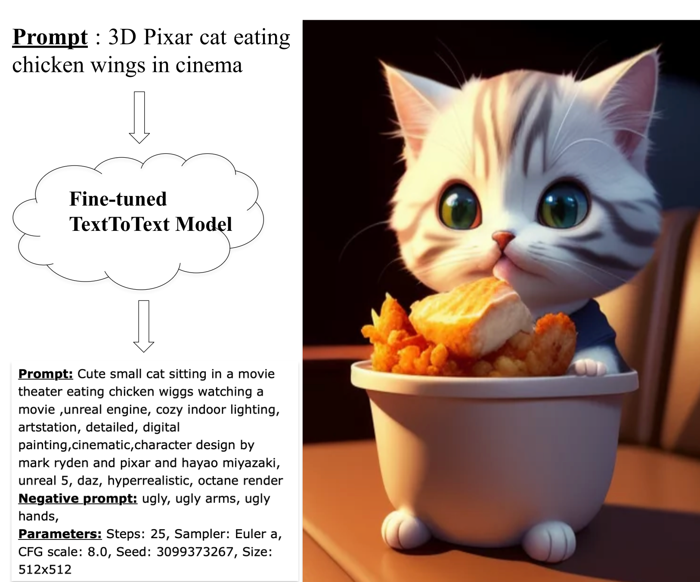
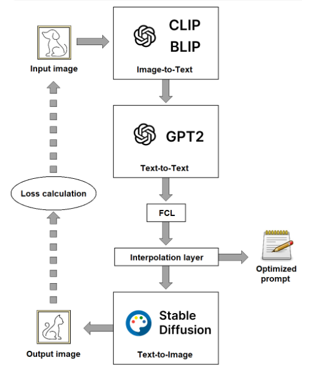
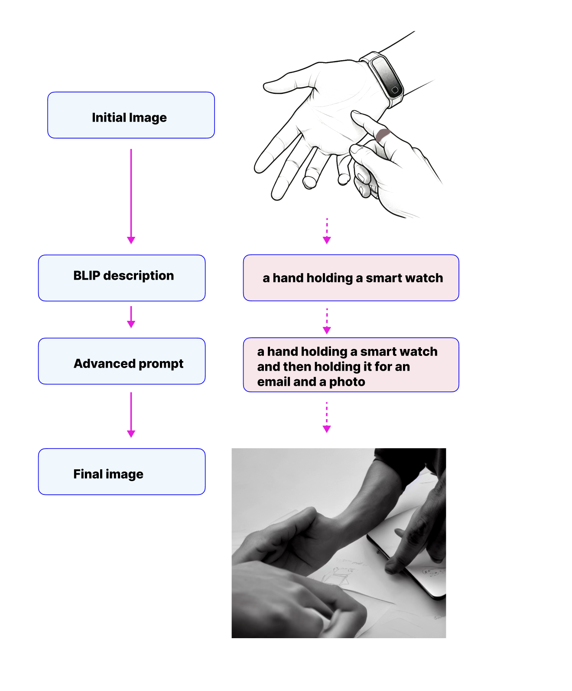
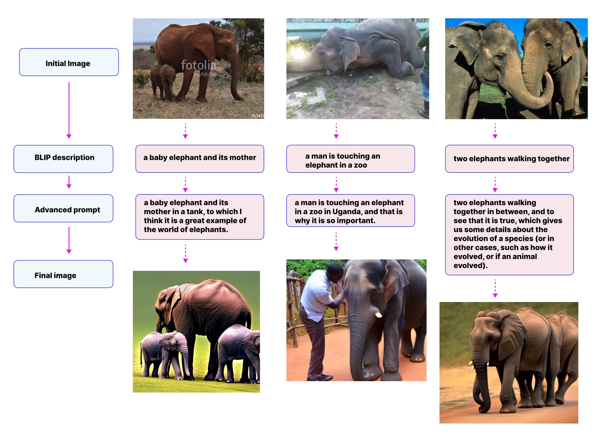
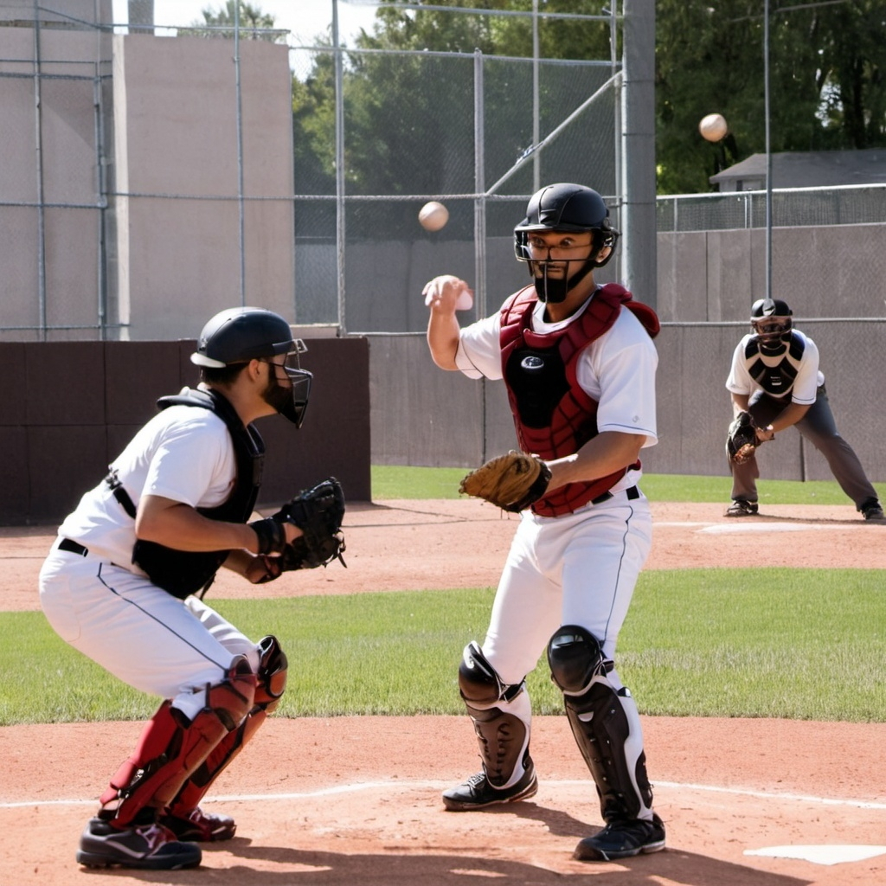

# EasyPrompt: Improving Text-to-Image Generation with Optimized Text-to-Text Model

## Abstract
EasyPrompt aims to simplify the process of generating accurate images from natural language prompts using advanced Text-to-Text (TtT) and Text-to-Image (TtI) models. We fine-tuned a TtT model using an unsupervised learning method to enhance prompt quality, facilitating better image generation.

## Introduction
Recent advancements in AI have significantly improved the capabilities of Text-to-Image models, producing near photo-realistic images. However, users without technical expertise often struggle to generate precise images due to the complexity of prompt engineering. EasyPrompt addresses this by enabling users to input natural, concise prompts while still achieving high-quality image outputs.

## Concept

The EasyPrompt system transforms short, natural prompts into detailed prompts that produce consistent and accurate images.

## Background
Prompt engineering, essential for optimizing AI-generated outputs, is divided into:
- **LLMs**: Focuses on refining prompts to avoid hallucination, improve accuracy, and enhance fine-tuning.
- **Image Generative Models**: Enhances the subjective task of describing images, addressing the unpredictable effects of keywords and requiring extensive experimentation.

## Methodology
The implementation involves three primary models:
1. **Image-to-Text (ItT)**: BLIP model generates basic image descriptions.
2. **Text-to-Text (TtT)**: GPT-2 model fine-tunes prompts.
3. **Text-to-Image (TtI)**: Stable Diffusion generates the final image.

The models are combined in a pipeline, fine-tuning the TtT model to transform basic prompts into optimized ones for the TtI model.

## Experiments

### Hardware and Limitations
- **Hardware**: Kaggle T4 GPU, 30 GB RAM, 16 GB GPU memory.
- **Limitations**:
  - Downscaled image input (224x224).
  - Output dimension (128x128), upscaled to 224x224.
  - Delta Tuning on limited layers.
  - Batch size of 1.
  - Limited number of epochs (<10).

### Datasets and Results
- **Singular Image Overfit**: Limited success with individual image overfitting.

- **Five Animal Images**: Improved results using Perceptual Loss.

- **COCO Dataset**: Challenges with generalizing the TtT model due to dataset mismatch and training imbalance.

## Conclusion
EasyPrompt demonstrates the potential for transforming simple prompts into advanced ones for image generation, though with limitations. Future improvements could include better preservation of language capabilities, enhanced transition models, and diversified image descriptors. Despite current constraints, the project opens pathways for more intricate solutions in prompt optimization.

## References
- Amatriain, X. (2024). Prompt Engineering in AI.
- Brown, T. et al. (2020). Language Models are Few-Shot Learners.
- Feng, Y. (2023). AI Art and Prompt Engineering.
- Oppenlaender, J. (2023). Improving Image Generation with Advanced Prompts.
- Ramesh, A. et al. (2021). Zero-Shot Text-to-Image Generation.
- Shuai, Z. (2024). A Survey of Text-to-Image Models.
- Wei, J. (2022). Fine-Tuning Language Models for Specific Tasks.
- Vaswani, A. et al. (2023). Attention Mechanisms in AI.
- Hu, E. (2023). Delta Tuning in Machine Learning.
- Walker, R. (2023). Retrieval-Augmented Generation.

## Implementation
For detailed implementation, please refer to the provided notebook. The README is included in the first cell of the notebook.

---

For more information, check out the [project repository](https://github.com/your-repo-link).
